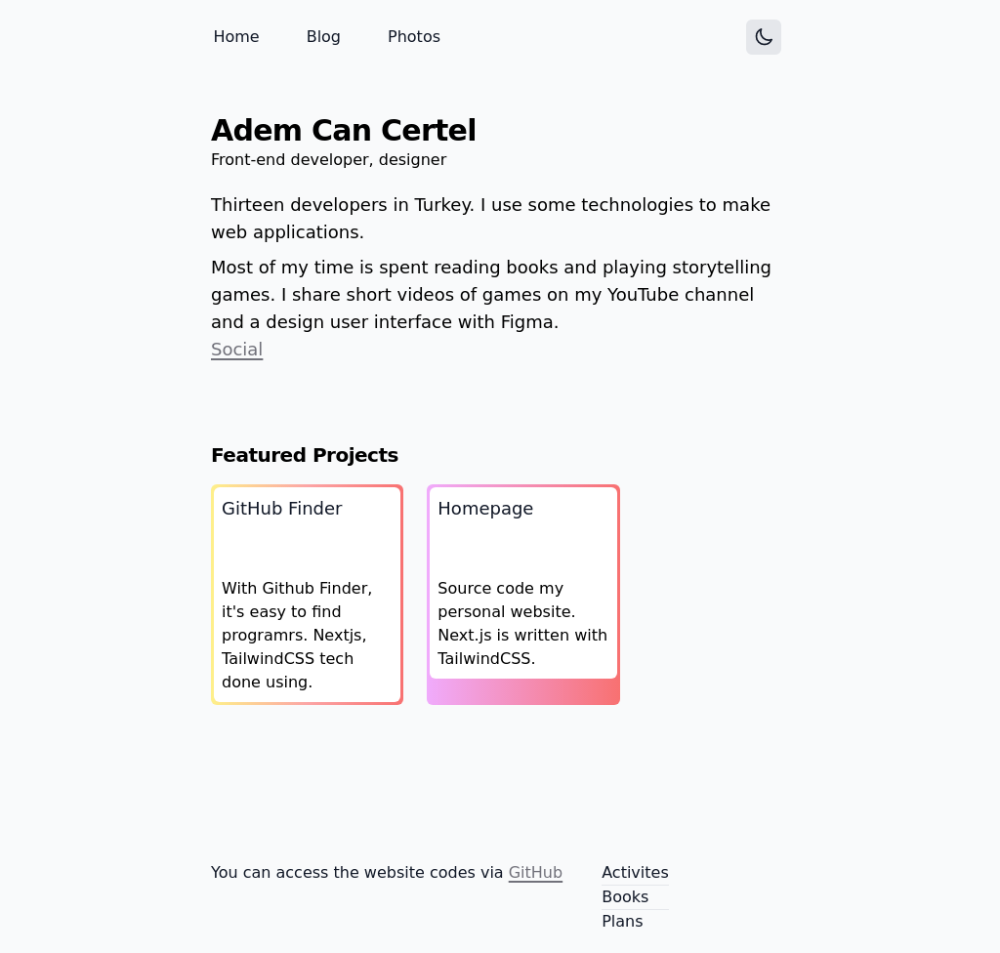

# Homepage

    

 

# Overview.

- `/` Home page.
- `pages/blog/[slug]` - Static 
- `pages/social` - Social page.
- `pages/photos` - Photos page.
- `pages/activites` - Activites page
   - Displays my steam and Spotify activities.
- `pages/books` - Books page
- `pages/plans` - Plans page
   - The page where I have all my plans and goals, and soon
- `pages/snippets` - Snippets page

# Getting Started
- project cloning using "git"
  - `.git clone`
- Package manager and downloading dependencies.
  - `npm install`
- Create an env file
  - `.env`  [`.env.example`](https://github.com/AdemCanCertel/hompage/blob/main/.env.example)
